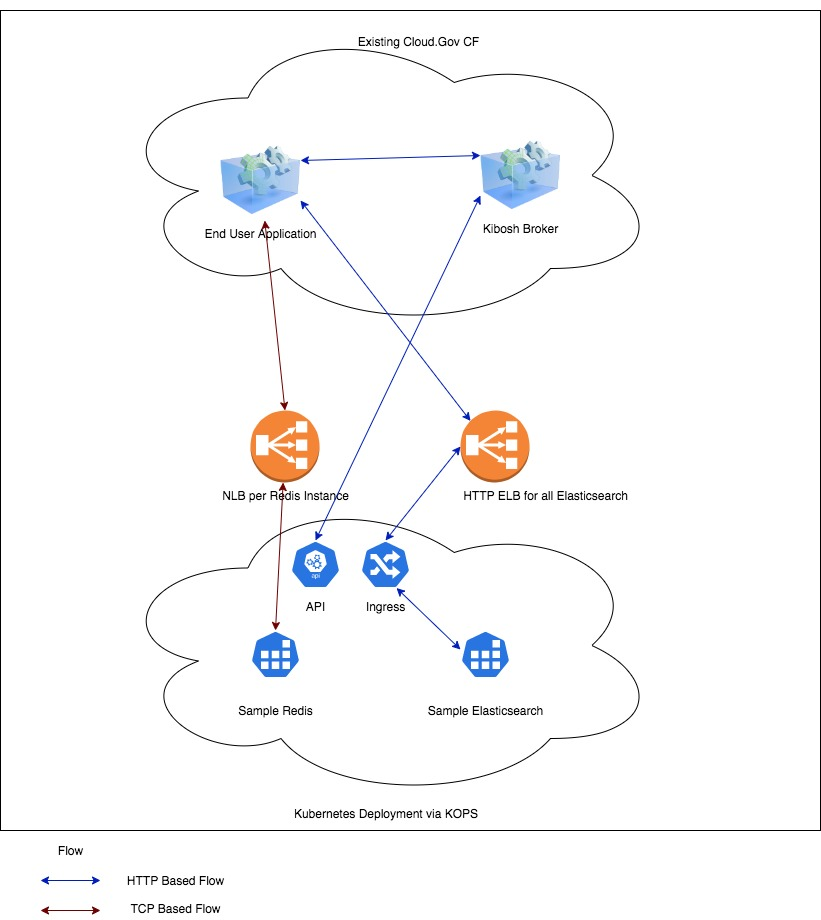

# Kibosh

Deploy pipeline for the Cloud Foundry Kibosh service broker.

The Kibosh broker deploys pre-configured Helm charts to a Kubernetes cluster.
We're using it to deploy Elasticsearch and Redis service instances.

## Links

**_TODO_**

* [Kibosh](https://github.com/cf-platform-eng/kibosh)
* Pipeline (is this CUI?)
* Elasticsearch Helm chart
* Redis Helm chart

## Development

**_TODO_**

## Architecture

### Kibosh

Kibosh itself is deployed as a Cloud Foundry application.

### Ingress Constraints

Applications need a way of connecting to their Elasticsearch or Redis service
instances.  These instances are StatefulSets running inside the Kubernetes
cluster, so unreachable from within the Cloud Foundry cluster.  To allow
connections, we need some form of Kubernetes Service (and possibly Ingress) in
between.

### Elasticsearch

Since Elasticsearch uses an HTTP-based protocol, we can use a single Nginx
Ingress controller to route to the right Elasticsearch service based on the
requested HTTP Host header.  Each Elasticsearch Helm chart includes an Ingress
resource with the correct host configuration.  All of these resources are
handled by the single Nginx controller, which is fronted by a single AWS
Network Load Balancer.

### Redis

Redis is more complicated, as it's [a custom TCP
protocol](https://redis.io/topics/protocol).  Because of this, we do not have a
Host header to use for routing.  We've considered a number of solutions:

#### NodePort Services

We could provision a NodePort service with each Redis instance.  This would
save money, but is non-viable due to changing node IP addresses.  We would need
to monitor the Kubernetes Node IP addresses as they change through
re-provisioning and cluster scaling, and update the service instances during
these events.

Worse, because Cloud Foundry doesn't (can't) update environment variables in
running application instances, the customer applications would still be
attempting to connect to non-existent Node IPs.

This is known as the "stale binding problem".

(Also, [think before you NodePort](https://oteemo.com/2017/12/12/think-nodeport-kubernetes/))

#### Round Robin DNS on the BOSH VMs

We could get around the stale binding problem by adding an agent on the BOSH
VMs that would monitor the Kubernetes Node IP addresses and maintain a set of
A-records for them in BOSH DNS.  Call this `k8s.cloud.gov.internal`, for
example.  Then we could point applications in Cloud Foundry at the
`k8s.cloud.gov.internal:NodePort` pair for their service instance.

However, this would require the authoring and maintenance of the agent.

Also, many applications _*cough*java*cough*_ don't play well with DNS TTLs,
meaning they'd experience prolonged downtime when the Kubernetes cluster
topology changes.

Finally, unless the BOSH DNS server randomizes the returned A-records,
applications would all pile up on the first Node.

#### Nginx TCP Ingress

(**This is our current path.**)

The Nginx controller [can actually act as a TCP
router](https://kubernetes.github.io/ingress-nginx/user-guide/exposing-tcp-udp-services/).
In this mode, it looks at ConfigMap entries to map separate external ports to
internal Services.

We could use this by injecting such a ConfigMap into each Helm deployment,
giving each Redis service a unique external port on the Nginx Network Load
Balancer.  We believe this configuration would work, but it does involve a bit
more configuration and management on our end.

#### Single Load Balancer per Redis

All of the above have been investigated in an attempt to reduce costs by not
requiring a separate AWS NLB for each Redis instance.  However, NLBs are
roughly $16 per month, and it looks as though we currently have fewer than 70
Redis instances deployed.

**If we believe this cost to be acceptable, then it's _much easier_ to
configure the Helm chart to provision a Kubernetes LoadBalancer, and call it a
day.**
